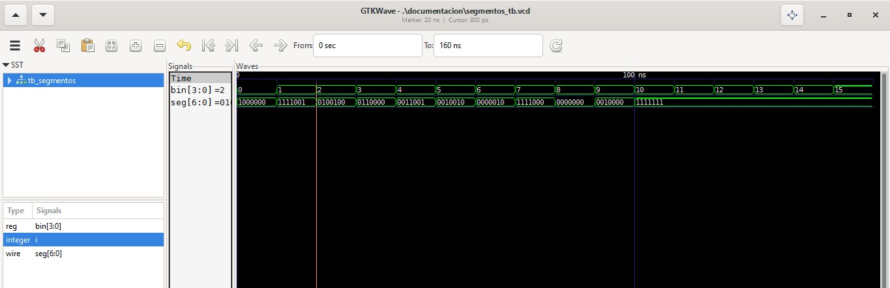
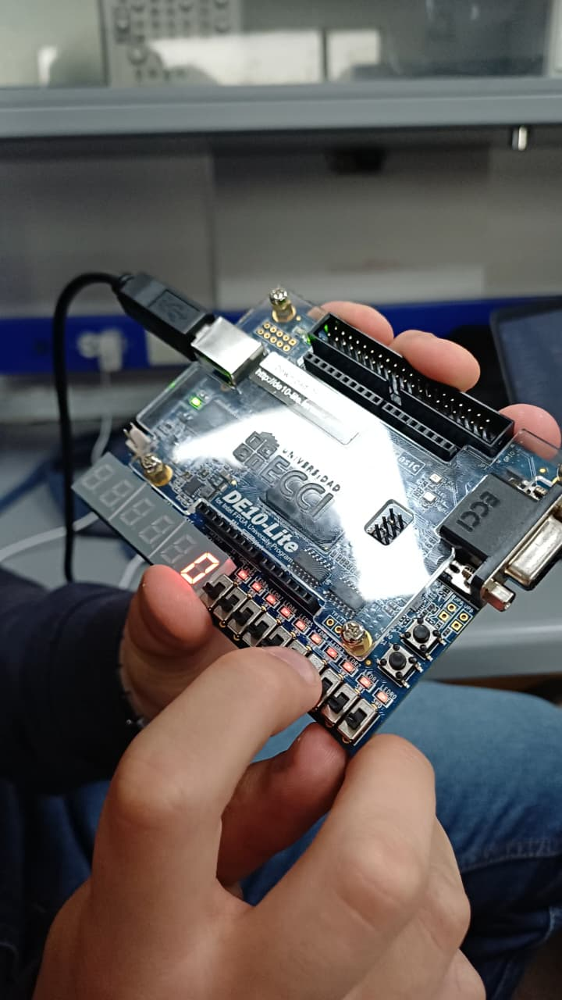

# Lab03 - Decodificador binario a 7 segmentos.

# Integrantes

* [Jareth Santiago Escamilla Marquez](https://github.com/jarethescamilla)

* [Diego Alexander Baron Pacheco](https://github.com/DiegoBp777)

* [Fredy Vicente Patiño Garzon](https://github.com/fredyvipatinoga-crypto)

**Grupo 2 (de los makias)**

# Informe

Indice:


- [Lab03 - Decodificador binario a 7 segmentos.](#lab03---decodificador-binario-a-7-segmentos)
- [Integrantes](#integrantes)
- [Informe](#informe)
  - [Documentación de los diseños implementados](#documentación-de-los-diseños-implementados)
  - [Simulaciones](#simulaciones)
  - [Evidencias de implementación](#evidencias-de-implementación)
  - [Preguntas](#preguntas)
  - [Conclusiones](#conclusiones)
  - [Referencias](#referencias)


## Documentación de los diseños implementados

* **Descripción general**

En este laboratorio se implementó un decodificador binario a display de 7 segmentos, capaz de visualizar números en formato hexadecimal y decimal utilizando la tarjeta DE10-Lite.

El sistema recibe una entrada binaria de 4 bits y la traduce a las señales necesarias para encender los segmentos correspondientes del display.

* **Parte 1: Código hexadecimal en display**

Se diseñó un sistema que permite visualizar los valores de 0 a F (hexadecimal) en un display de 7 segmentos mediante el uso de switches.

Para esto se utilizó una estructura tipo case en Verilog, donde cada combinación de entrada activa los segmentos necesarios.

* **Parte 2: Visualización de suma de 3 bits**

Se implementó un sistema que:

* Recibe dos números de 3 bits
* Realiza la suma
* Muestra el resultado en el display de 7 segmentos

El resultado puede representarse en:

* Decimal
* Hexadecimal

**Fundamento teórico**

**Código BCD**

El código BCD (Binary Coded Decimal) representa cada dígito decimal mediante 4 bits.

**Ejemplo:**

 


**Display de 7 segmentos**

Un display de 7 segmentos está compuesto por 7 LEDs organizados para representar números.

**Tipos:**

* **Ánodo común**
* **Cátodo común**

En la tarjeta DE10-Lite se utiliza configuración de ánodo común, lo que implica que:

* Un 0 lógico enciende el segmento
* Un 1 lógico lo apaga

**Implementación en Verilog**

El decodificador se implementa mediante:

* Bloque **always**
* Estructura **case**
* Salida de 7 bits (a–g)

Ejemplo conceptual:

```verilog
case(bin)
  4'd0: seg = 7'b1000000;
  4'd1: seg = 7'b1111001;
  4'd2: seg = 7'b0100100;
  4'd3: seg = 7'b0110000;
  ...
endcase
```

***(Este bloque asigna el patrón de segmentos para cada valor de entrada.)***

## Simulaciones 
**Descripción**

Se realizaron simulaciones utilizando GTKWave junto con Icarus Verilog para verificar:

Correcta visualización de números 0–F
Funcionamiento del sumador de 3 bits
Correspondencia entre entrada binaria y salida del display

**Evidencia**

  


***Se observa que la señal bin recorre los valores de 0 a 15, mientras que la salida seg cambia al valor de entrada, mostrando correctamente los dígitos del 0 al 9 y activando el caso default para valores mayores.***

## Evidencias de implementación

* **Montaje en FPGA**

  


***Figura 1. Implementación del sistema en la FPGA DE10-Lite.***


* **Resultado en display**

  

***Figura 2. Visualización del resultado en el display de 7 segmentos.***

* **Video**

[Ver video de funcionamiento / Parte1](https://youtube.com/shorts/k2-qjs-qY5c)

[Ver video de funcionamiento / Parte 2](https://youtube.com/shorts/spV5hhUNHow)

## Preguntas

**1. ¿Cuál es el rango máximo de salida de un sumador de 3 bits?**

El rango de salida de un sumador de 3 bits va de:

* Mínimo: 0 (000 + 000)
* Máximo: 14 (111 + 111 = 1110)

Por lo tanto, se requieren 4 bits para representar el resultado.
   
**2. En el diseño del decodificador de 7 segmentos, ¿qué estructura de Verilog modela el comportamiento de un multiplexor? Explique.**

La estructura que modela un multiplexor en Verilog es el bloque:

```verilog 
case
```
También puede implementarse mediante operadores condicionales **(if-else).**

**3. ¿Qué tipo de display usa la tarjeta de desarrollo DE10-Lite (ánodo común o cátodo común) y cómo afecta eso al diseño?**

La DE10-Lite utiliza un display de ánodo común, lo que implica que:

* Los segmentos se activan con **0**
* Se deben invertir las salidas del decodificador

   
**4. Si se quisiera realizar la implementación del sumador/restador de 4 bits, que cambios deberian hacerse al diseño implementado en la segunda parte de este laboratorio? Explique mediante diagrama de caja negra.**

Se deben realizar los siguientes cambios:

* Ampliar el tamaño de los operandos a 4 bits
* Ajustar el decodificador para manejar resultados más grandes
* Incorporar lógica de selección (suma/resta)


   
**5. ¿Como debería adaptarse el diseño propuesta para que la salida del sumador muestre el resultado en sistema decimal y no en sistema hexadecimal?**

Para representar ambos sistemas:

* **Decimal:** limitar salidas a 0–9
* **Hexadecimal:** incluir valores A–F

Esto se logra modificando el **case** del decodificador.


## Conclusiones

Durante el desarrollo del laboratorio se logró implementar un decodificador binario a 7 segmentos utilizando lenguaje Verilog, cumpliendo con el objetivo de representar valores decimales a partir de una entrada de 4 bits. El sistema diseñado, basado en una estructura combinacional con un bloque `always` y una sentencia `case`, permitió mapear correctamente cada valor de entrada a su correspondiente patrón de salida en el display.

A partir de los resultados obtenidos en la simulación mediante GTKWave, se evidenció que la señal de entrada `bin` recorre correctamente todos los valores posibles, mientras que la salida `seg` responde de acuerdo con la codificación definida. Esto confirma el correcto funcionamiento lógico del diseño, así como la coherencia entre el comportamiento esperado y el observado experimentalmente.

Durante el proceso de implementación se presentaron algunas dificultades, principalmente relacionadas con la interpretación de la lógica del display de 7 segmentos utilizado en la FPGA DE10-Lite, el cual opera con configuración de ánodo común. Esto implicó trabajar con lógica invertida para la activación de los segmentos, lo cual generó la necesidad de realizar pruebas y ajustes en los valores binarios asignados en el código.

Como limitación del sistema, se identificó que el diseño únicamente contempla la representación de valores decimales (0–9), mientras que los valores superiores son tratados mediante el caso `default`, lo que restringe su uso para aplicaciones que requieran representación completa en formato hexadecimal. Además, el uso de una estructura tipo tabla (case) puede dificultar la escalabilidad del diseño frente a sistemas más complejos.

En conclusión, el laboratorio permitió fortalecer la comprensión de los sistemas digitales combinacionales, el uso de descripciones en Verilog y la importancia de la simulación como herramienta de validación. Asimismo, se resalta la relevancia de considerar las características físicas del hardware al momento de implementar soluciones digitales, integrando de manera efectiva el diseño teórico con su ejecución práctica.

## Referencias
* Guía del laboratorio – Técnicas Digitales
* Documentación Intel FPGA
* Material de clase