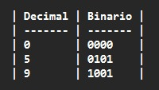

# Lab03 - Decodificador binario a 7 segmentos.

# Integrantes

* [Jareth Santiago Escamilla Marquez](https://github.com/jarethescamilla)

* [Diego Alexander Baron Pacheco](https://github.com/DiegoBp777)

* [Fredy Vicente Patiño Garzon](https://github.com/fredyvipatinoga-crypto)

**Grupo 2 (de los makias)**

# Informe

Indice:

- [Lab03 - Decodificador binario a 7 segmentos.](#lab03---decodificador-binario-a-7-segmentos)
- [Integrantes](#integrantes)
- [Informe](#informe)
  - [Documentación de los diseños implementados](#documentación-de-los-diseños-implementados)
  - [Simulaciones](#simulaciones)
  - [Evidencias de implementación](#evidencias-de-implementación)
  - [Preguntas](#preguntas)
  - [Conclusiones](#conclusiones)
  - [Referencias](#referencias)

## Documentación de los diseños implementados

* **Descripción general**

En este laboratorio se implementó un decodificador binario a display de 7 segmentos, capaz de visualizar números en formato hexadecimal y decimal utilizando la tarjeta DE10-Lite.

El sistema recibe una entrada binaria de 4 bits y la traduce a las señales necesarias para encender los segmentos correspondientes del display.

* **Parte 1: Código hexadecimal en display**

Se diseñó un sistema que permite visualizar los valores de 0 a F (hexadecimal) en un display de 7 segmentos mediante el uso de switches.

Para esto se utilizó una estructura tipo case en Verilog, donde cada combinación de entrada activa los segmentos necesarios.

* **Parte 2: Visualización de suma de 3 bits**

Se implementó un sistema que:

* Recibe dos números de 3 bits
* Realiza la suma
* Muestra el resultado en el display de 7 segmentos

El resultado puede representarse en:

* Decimal
* Hexadecimal

* **Fundamento teórico**

**Código BCD**

El código BCD (Binary Coded Decimal) representa cada dígito decimal mediante 4 bits.

**Ejemplo:**

 

## Simulaciones 

## Evidencias de implementación

## Preguntas

Respondan las siguientes preguntas:

1. ¿Cuál es el rango máximo de salida de un sumador de 3 bits?
   
2. En el diseño del decodificador de 7 segmentos, ¿qué estructura de Verilog modela el comportamiento de un multiplexor? Explique.

3. ¿Qué tipo de display usa la tarjeta de desarrollo DE10-Lite (ánodo común o cátodo común) y cómo afecta eso al diseño?
   
4. Si se quisiera realizar la implementación del sumador/restador de 4 bits, que cambios deberian hacerse al diseño implementado en la segunda parte de este laboratorio? Explique mediante diagrama de caja negra.
   
5. ¿Como debería adaptarse el diseño propuesta para que la salida del sumador muestre el resultado en sistema decimal y no en sistema hexadecimal?

## Conclusiones

<!-- En esta sección se debe presentar un análisis crítico de los resultados obtenidos y del proceso de diseño e implementación realizado. Este apartado debe incluir una reflexión sobre el cumplimiento de los objetivos planteados, el funcionamiento del sistema desarrollado, así como el análisis de posibles errores, limitaciones o dificultades encontradas durante la práctica.  -->

## Referencias
